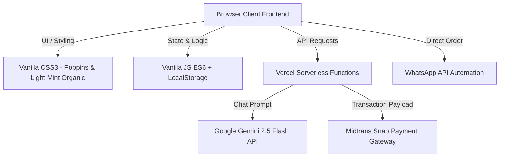
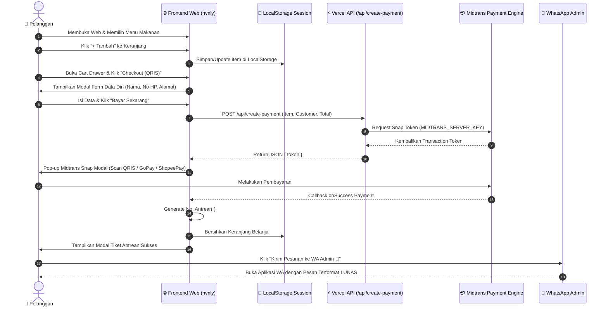
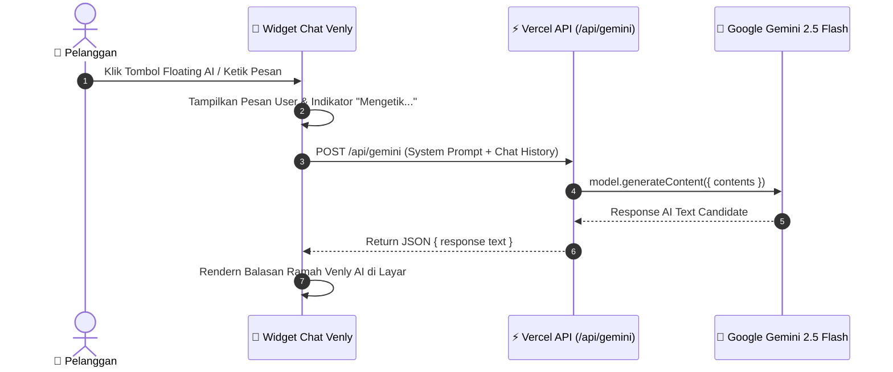
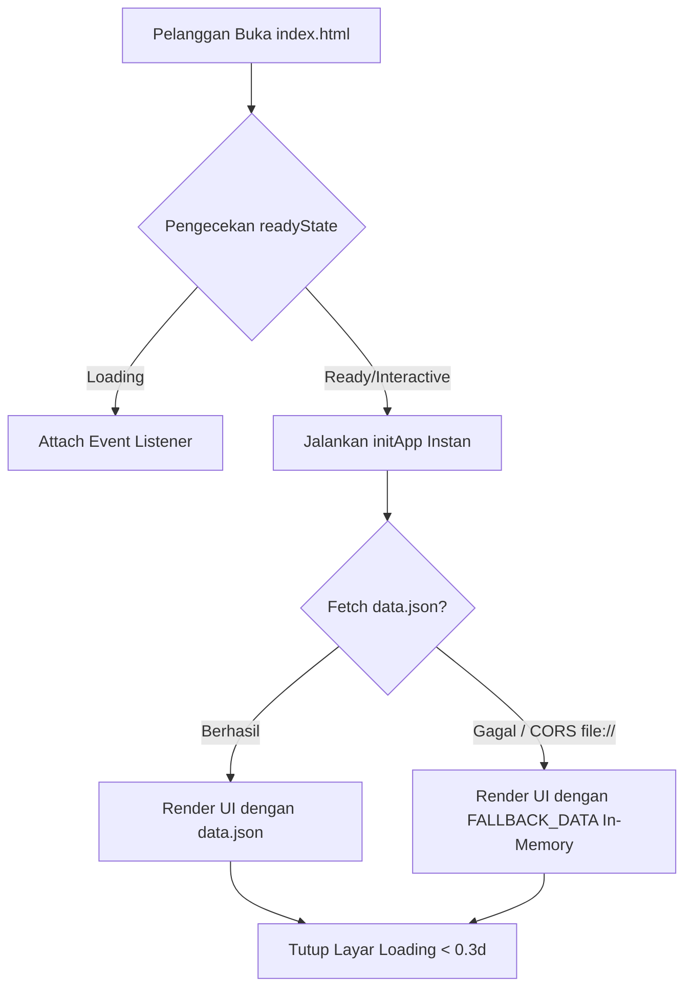

# 🍲 Dokumentasi Sistem & Arsitektur Proyek — Heavenly Food (`hvnly`)

Dokumen ini berisi penjelasan lengkap mengenai arsitektur sistem, struktur proyek, komponen/teknologi yang digunakan, serta alur kerja (*system & data flow*) untuk aplikasi web **Heavenly Food (`hvnly`)**.

---

## 📑 Daftar Isi
1. [Ringkasan Eksekutif](#1-ringkasan-eksekutif)
2. [Struktur Proyek (Directory Tree)](#2-struktur-proyek-directory-tree)
3. [Komponen & Tech Stack / Framework](#3-komponen--tech-stack--framework)
4. [Alur & Diagram Sistem (System & Data Flow)](#4-alur--diagram-sistem-system--data-flow)
5. [Spesifikasi Fitur Utama](#5-spesifikasi-fitur-utama)
6. [Panduan Setup & Environment Variables](#6-panduan-setup--environment-variables)

---

## 1. 📌 Ringkasan Eksekutif

**Heavenly Food (`hvnly`)** adalah platform *micro e-commerce static* dan *brand showcase* untuk bisnis kuliner rumahan khas Malang. Aplikasi ini dirancang agar **ultra-ringan, sangat cepat (<0.3 detik waktu muat)**, dan memiliki estetika visual *Fresh Light Organic* berbasis tipografi 100% **Poppins**.

### **Fitur Unggulan:**
* 🛒 **Local Cart Session**: Keranjang belanja tanpa database berbasis `localStorage`.
* 🤖 **Venly AI Assistant**: Floating chatbot interaktif bertenaga Google Gemini 2.5 Flash AI.
* 💳 **Midtrans Payment Gateway**: Pembayaran digital serbaguna (QRIS & E-Wallet) via Serverless API.
* 🎟️ **Generasi Nomor Antrean**: Pembuatan ID antrean unik berformat `#HVN-YYYYMMDD-XXXX`.
* 🚀 **Automated WhatsApp Checkout**: Pengiriman rincian antrean dan bukti bayar langsung ke WhatsApp Admin.

---

## 2. 📁 Struktur Proyek (Directory Tree)

Berikut adalah struktur hirarki berkas dan folder pada repositori `hvnly`:

```text
d:\laragon\www\hvnly\
├── 📄 index.html              # Main Single Page Application (SPA) layout & markup
├── 📄 manifest.json            # Web App Manifest untuk PWA (Installable App & Icons)
├── 📄 sw.js                   # Service Worker untuk offline caching & PWA resilience
├── 📄 data.json                # Database JSON produk menu, cerita tentang, galeri, ulasan, & kontak
├── 📄 package.json             # Konfigurasi dependensi Node.js & modul serverless
├── 📄 README.md                # Ringkasan singkat proyek
├── 📄 PROJECT_DOCUMENTATION.md # [File Ini] Dokumentasi lengkap arsitektur & alur sistem
│
├── 📂 api/                     # Vercel Serverless Backend API Functions
│   ├── 📄 gemini.js            # Serverless proxy ke Google Generative AI (Gemini 2.5 Flash)
│   └── 📄 create-payment.js    # Serverless proxy ke Midtrans Snap Payment Gateway
│
├── 📂 src/                     # Source code modul frontend
│   ├── 📂 css/
│   │   └── 📄 style.css        # Design system Fresh Light Organic (100% Poppins, variables, animations)
│   └── 📂 js/
│       ├── 📄 app.js           # Core client application controller & global event delegation
│       ├── 📄 cart-session.js  # LocalStorage cart session manager
│       └── 📄 wa-builder.js    # Utility pembuat URL WhatsApp terformat & terenkripsi URI
│
└── 📂 images/                  # Aset gambar & media
    ├── 📄 logo.png             # Logo utama Heavenly Food
    ├── 📄 signature.png        # Gambar sajian signature hero
    ├── 📄 chatbot.png          # Ikon avatar Venly AI Assistant
    ├── 📄 about.png            # Foto tentang dapur Heavenly
    ├── 📂 menu/                # Foto-foto produk makanan & minuman
    └── 📂 gallery/             # Koleksi foto galeri makanan
```

### **Penjelasan Peran Berkas Kunci:**

| Nama Berkas | Deskripsi & Peran Utama |
| :--- | :--- |
| **`index.html`** | Berkas HTML utama yang berisi komponen header, hero, filter menu, galeri, ulasan, kontak, modal detail, cart drawer, modal checkout, modal tiket antrean, dan widget Venly AI. Juga menyediakan *fallback data lokal* jika koneksi internet/server terhambat. |
| **`src/css/style.css`** | Mengatur seluruh variabel desain (*design tokens*), tipografi Poppins, efek *glassmorphism*, micro-animation, serta pemetaan ganda ID/Class lama & baru. |
| **`src/js/app.js`** | Pusat logika frontend yang menangani *event delegation*, filter kategori menu, popup modal, transisi layar loading, callback transaksi Midtrans, dan pengiriman pesan ke Venly AI. |
| **`api/gemini.js`** | Backend serverless Vercel yang mengamankan `GEMINI_API_KEY` dan meneruskan prompt obrolan pelanggan ke model AI `gemini-2.5-flash`. |
| **`api/create-payment.js`** | Backend serverless Vercel yang mengamankan `MIDTRANS_SERVER_KEY`, memproses item transaksi, dan menerbitkan `snap token` untuk pembayaran QRIS/E-Wallet. |

---

## 3. 🛠️ Komponen & Tech Stack / Framework

Sistem dibangun dengan arsitektur **Jamstack Static Web Application** tanpa *overhead* framework berat (Zero-React/Vue overhead di frontend):



### **Detail Teknologi Per-Layer:**

#### **1. Frontend Layer (User Interface)**
* **HTML5 Semantic**: Struktur web bersih menggunakan elemen `<header>`, `<main>`, `<section>`, `<article>`, `<aside>`, dan `<footer>`.
* **CSS Custom Properties (Vanilla CSS3)**:
  * Font Family: **Poppins** (`300`, `400`, `500`, `600`, `700`, `800`).
  * Tema Visual: Soft Mint White (`#f4fbf6`), Emerald Green (`#10b981`), Crisp White Cards, Soft Shadows (`rgba(0,0,0,0.04)`).
  * Efek Polish: Backdrop Blur Filter (`backdrop-filter: blur(16px)`), Pop-up Spring Animation, Button Press Effect (`active:scale-95`).
* **JavaScript Client (ES Modules & Delegation)**:
  * Menggunakan *Global Event Delegation* pada `document` untuk menghindari *memory leak* dan memastikan tombol dinamis (`.btn-add`, `.btn-detail`, `.category-tab`) bekerja 100% akurat.

#### **2. Backend & Serverless API Layer**
* **Node.js Environment** (Runtime Serverless pada Vercel Functions).
* **`@google/generative-ai` (v0.12.0)**: SDK resmi Google AI untuk komunikasi cepat ke model `gemini-2.5-flash`.
* **`midtrans-client` (v1.3.1)**: SDK resmi Midtrans untuk membuat transaksi Snap dan mendapatkan *Snap Payment Token*.

#### **3. Storage & Persistence Layer**
* **LocalStorage (`hvnly_cart_session`)**: Menyimpan item keranjang, kuantitas, dan total belanja secara client-side.
* **LocalStorage (`hvnly_customer_info`)**: Menyimpan nama, nomor WhatsApp, alamat, dan catatan pembeli untuk mempercepat transaksi berikutnya.
* **In-Memory Fallback (`FALLBACK_DATA`)**: Menyediakan data lokal instan di frontend jika `data.json` gagal di-fetch (misalnya saat file dibuka langsung via `file://`).

---

## 4. 🔄 Alur & Diagram Sistem (System & Data Flow)

### **A. Alur Pemesanan & Pembayaran (Order & Payment Flow)**

Diagram di bawah menggambarkan perjalanan pengguna dari memilih menu hingga mendapatkan nomor antrean dan mengirimkan pesanan ke WhatsApp Admin:



---

### **B. Alur Venly AI Assistant (Chatbot Gemini Flow)**

Diagram di bawah menggambarkan alur saat pengguna berinteraksi dengan AI Assistant **Venly**:



---

### **C. Alur In-Memory Fallback (Offline / Direct File Execution)**

Diagram di bawah menjelaskan mekanisme yang mencegah web berputar/stuck saat dibuka via `file://`:



---

## 5. ⚙️ Spesifikasi Fitur Utama

### **1. Venly AI Assistant**
* **System Prompt Scope**: Menjawab informasi seputar Heavenly Food, pemilik (Mas Filla & Mas Angga), lokasi (Malang), daftar menu (Nasi Ayam Teriyaki, Bento, Salad Buah, Nasi Kikir, Jumat Berkah), rentang harga (Rp 8.000 - Rp 23.000), dan mengarahkan pemesanan ke WhatsApp `+62 821-3251-7964`.

### **2. Format Nomor Antrean (Queue Ticket Format)**
* Format: `#HVN-[YYYYMMDD]-[XXXX]`
* Contoh: `#HVN-20260811-4819`
* `YYYYMMDD` = Tanggal transaksi (Tahun, Bulan, Hari).
* `XXXX` = 4 digit angka acak unik per transaksi.

### **3. Format Pesan Otomatis WhatsApp**
Pesan terenkripsi URI yang dikirimkan ke Admin:
```text
Halo Admin Heavenly Food! Saya sudah melakukan pembayaran via web.

📌 *DETAIL PESANAN*
----------------------------------
🆔 *No. Antrean:* #HVN-20260811-4819
👤 *Nama:* Budi Santoso
📱 *No. HP:* 081234567890
📍 *Alamat:* Jalan Suhat No. 12, Malang

📦 *Rincian Menu:*
- 2x Nasi Ayam Teriyaki (Rp 24.000)
- 1x Salad Buah - Kecil (Rp 15.000)

💰 *Total Pembayaran:* Rp 39.000
💳 *Status Pembayaran:* LUNAS (QRIS via Web)
----------------------------------
Mohon segera diproses dan dikirim ya min, terima kasih! 🙏
```

---

## 6. 🔧 Panduan Setup & Environment Variables

### **A. Environment Variables Required (`.env`)**

Untuk menjalankan fitur AI dan Pembayaran secara live di Vercel/Local Server, buat berkas `.env` di root folder proyek:

```env
# Google Gemini AI Config
GEMINI_API_KEY=AIzaSy... (API Key dari Google AI Studio)

# Midtrans Payment Gateway Config
MIDTRANS_SERVER_KEY=SB-Mid-server-... (Server Key dari Midtrans Dashboard)
MIDTRANS_CLIENT_KEY=SB-Mid-client-... (Client Key dari Midtrans Dashboard)
MIDTRANS_IS_PRODUCTION=false
```

### **B. Perintah Perawatan & Pengujian**

```powershell
# 1. Install Dependensi Node.js
npm install

# 2. Cek Sintaksis JavaScript (Tanpa Error)
node --check src/js/cart-session.js
node --check src/js/wa-builder.js
node --check src/js/app.js
node --check api/create-payment.js
node --check api/gemini.js

# 3. Jalankan Local Serverless Dev Environment
npx vercel dev
```

---

*Dokumentasi ini dibuat secara otomatis dan komprehensif untuk proyek Heavenly Food (`hvnly`).*
